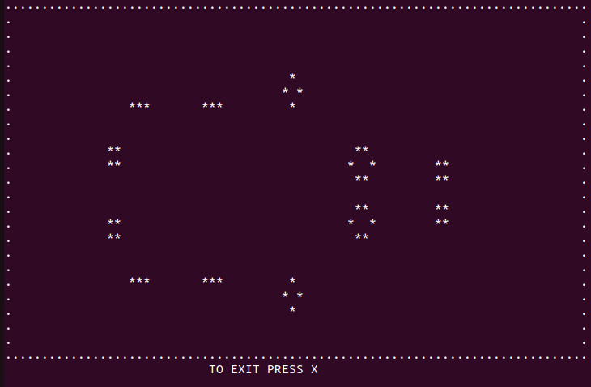

# Console application: Game of life

Here you can find realization game of life in 6 different initial configurations

## Available operating systems
- macos
- linux

## How to start?

Open your Terminal and print: 

    gcc game_of_life.c -lncurses
    
    ./a.out

## How to play?

- Print one number from 1 to 6 - it is diffrent initial configurations

- Speed: fast/low - w/s

- Exit: X
 
Just watch and enjoy!
